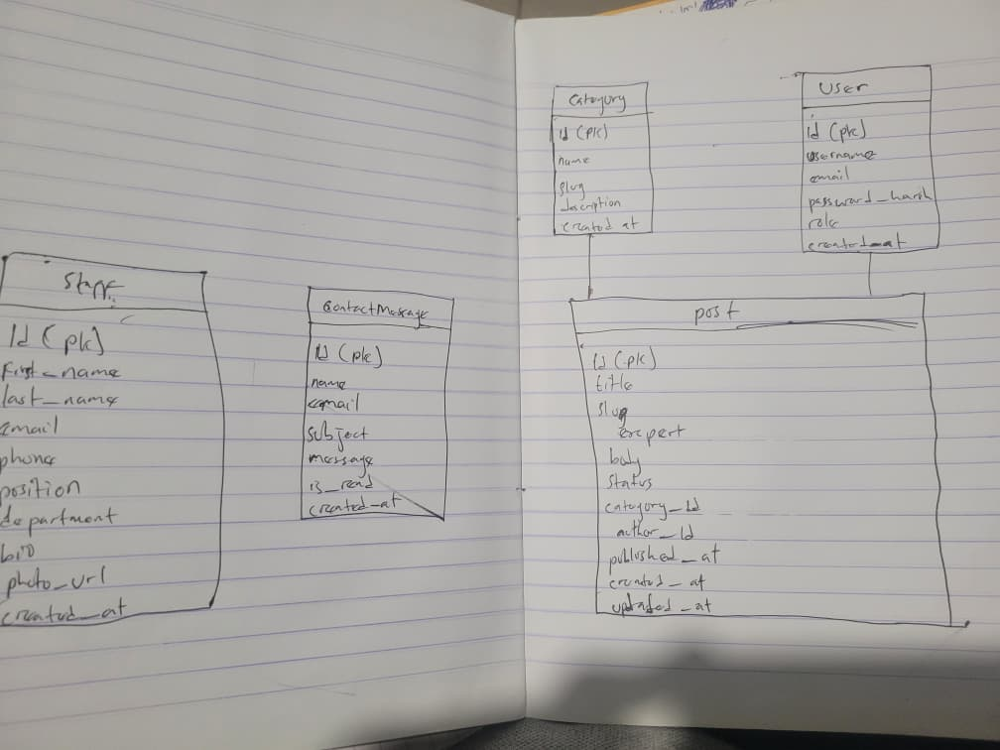

# Data Model

## Category

A grouping for posts, e.g. Events, Admissions, Research.

| Field | Type | Rules | Notes |
|---|---|---|---|
| id | integer | primary key, auto-increment | |
| name | text, max 100 | required, unique | e.g. "Events" |
| slug | text, max 100 | required, unique | URL-safe version of name |
| description | text, max 500 | optional | |
| created_at | datetime | required | set automatically |

## Staff

A lecturer or member of staff.

| Field | Type | Rules | Notes |
|---|---|---|---|
| id | integer | primary key, auto-increment | |
| first_name | text, max 100 | required | |
| last_name | text, max 100 | required | |
| email | text, max 255 | required, unique | |
| phone | text, max 20 | optional | |
| position | text, max 150 | required | e.g. "Senior Lecturer" |
| department | text, max 150 | required | e.g. "Computer Engineering" |
| bio | long text | optional | |
| photo_url | text, max 500 | optional | link to profile picture |
| created_at | datetime | required | set automatically |

## Post

A news item or blog article.

| Field | Type | Rules | Notes |
|---|---|---|---|
| id | integer | primary key, auto-increment | |
| title | text, max 200 | required | |
| slug | text, max 200 | required, unique | URL-safe version of title |
| excerpt | text, max 500 | required | short summary for listing page |
| body | long text | required | full article content |
| status | text, max 20 | required | either `draft` or `published` |
| category_id | integer | required, foreign key | points to Category |
| author_id | integer | required, foreign key | points to User |
| published_at | datetime | optional | set when status becomes published |
| created_at | datetime | required | set automatically |
| updated_at | datetime | required | set automatically |

## User

The admin who logs in and publishes posts.

| Field | Type | Rules | Notes |
|---|---|---|---|
| id | integer | primary key, auto-increment | |
| username | text, max 100 | required, unique | |
| email | text, max 255 | required, unique | |
| password_hash | text, max 255 | required | never store plain password |
| role | text, max 20 | required | either `admin` or `editor` |
| created_at | datetime | required | set automatically |

## ContactMessage

A message sent through the contact form.

| Field | Type | Rules | Notes |
|---|---|---|---|
| id | integer | primary key, auto-increment | |
| name | text, max 150 | required | sender's name |
| email | text, max 255 | required | sender's email |
| subject | text, max 200 | required | |
| message | long text | required | |
| is_read | boolean | required | default: false |
| created_at | datetime | required | set automatically |

## Relationships




```
┌──────────────┐       ┌──────────────┐
│   Category   │       │     User     │
├──────────────┤       ├──────────────┤
│ id (PK)      │       │ id (PK)      │
│ name         │       │ username     │
│ slug         │       │ email        │
│ description  │       │ password_hash│
│ created_at   │       │ role         │
└──────┬───────┘       │ created_at   │
       │               └──────┬───────┘
       │ 1                     │ 1
       │                       │
       │ *                     │ *
┌──────┴───────────────────────┴───────┐
│               Post                   │
├──────────────────────────────────────┤
│ id (PK)                              │
│ title                                │
│ slug                                 │
│ excerpt                              │
│ body                                 │
│ status                               │
│ category_id (FK → Category.id)       │
│ author_id (FK → User.id)             │
│ published_at                         │
│ created_at                           │
│ updated_at                           │
└──────────────────────────────────────┘

┌──────────────┐       ┌──────────────────┐
│    Staff     │       │ ContactMessage   │
├──────────────┤       ├──────────────────┤
│ id (PK)      │       │ id (PK)          │
│ first_name   │       │ name             │
│ last_name    │       │ email            │
│ email        │       │ subject          │
│ phone        │       │ message          │
│ position     │       │ is_read          │
│ department   │       │ created_at       │
│ bio          │       └──────────────────┘
│ photo_url    │
│ created_at   │
└──────────────┘
```

- A **Category** has many **Posts**
- A **User** has many **Posts** (as author)
- A **Post** belongs to one **Category**
- A **Post** belongs to one **User** (author)
- **Staff** and **ContactMessage** are independent tables

